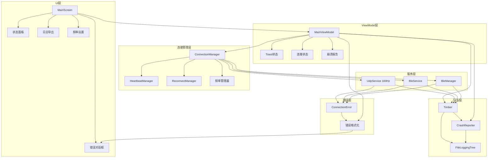
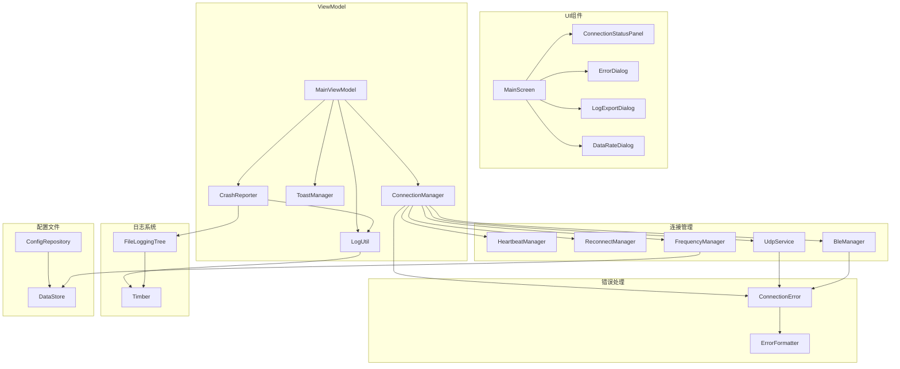
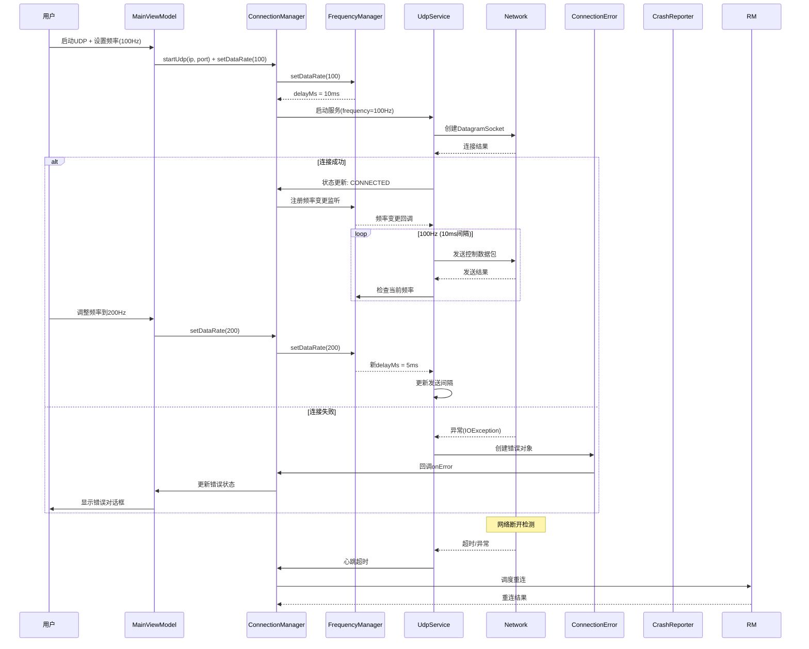
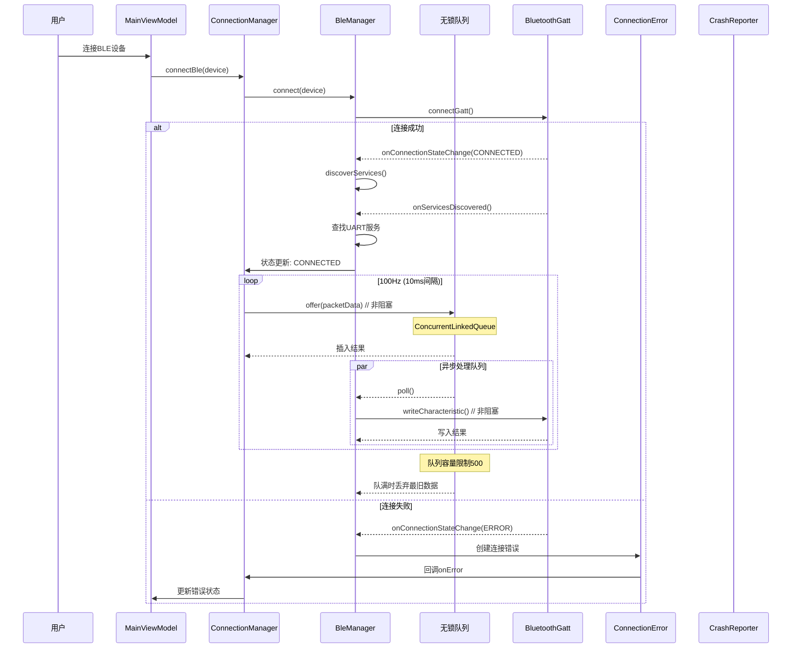
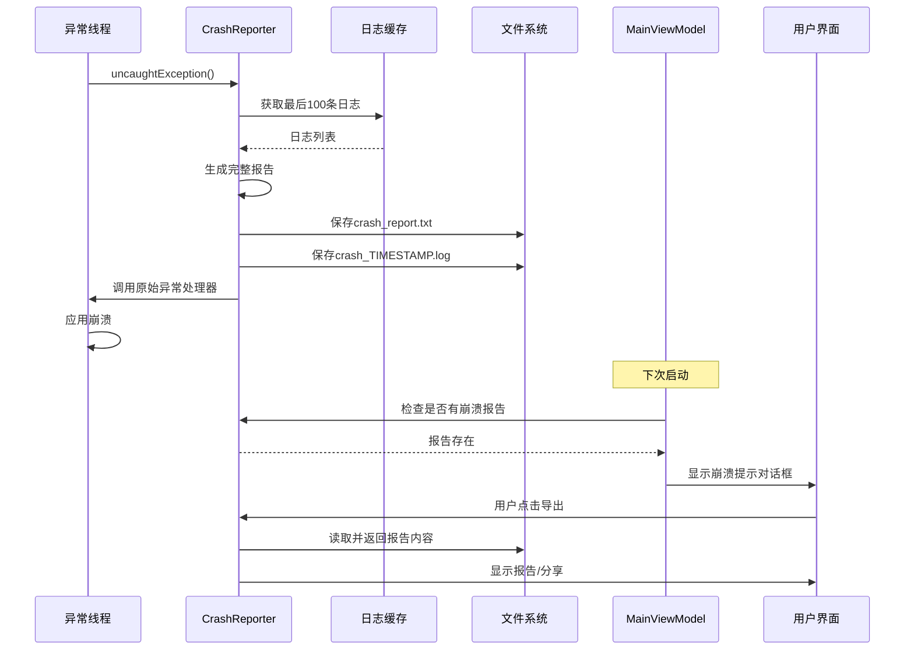
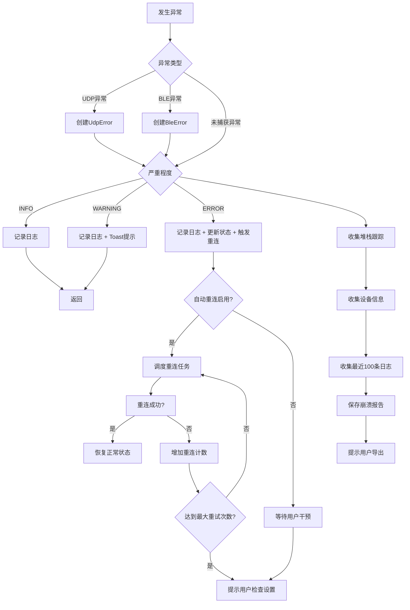

# DESIGN_UDP_BLE_Improvement.md

## 系统架构设计

### 整体架构图



### 分层设计说明

**UI层（Presentation）**
- 负责用户界面展示和交互
- 包含状态面板、错误对话框、日志导出、频率设置组件
- 通过StateFlow接收ViewModel的状态更新
- **非阻塞要求**：所有UI事件采用非阻塞回调

**ViewModel层（ViewModel）**
- 业务逻辑的中介者
- 订阅连接状态流和错误流
- 管理Toast消息和用户反馈
- 调用ConnectionManager执行连接操作
- 频率配置管理

**连接管理层（Domain）**
- 核心业务逻辑所在
- ConnectionManager：统一连接状态管理
- HeartbeatManager：心跳检测调度
- ReconnectManager：自动重连逻辑
- FrequencyManager：数据频率配置管理
- 与具体通信协议解耦

**服务层（Data）**
- 现有的UdpService和BleService（增强版）
- BleManager：BLE设备管理
- 增强的错误回调机制
- 状态上报接口
- 100Hz动态频率发送

**日志层（Infrastructure）**
- Timber日志框架
- FileTree：完全异步文件日志写入
- CrashReporter：全局崩溃捕获
- 支持日志级别控制

**错误层（Domain）**
- ConnectionError：错误枚举定义
- 错误分类和本地化支持

## 模块依赖图



## 接口契约定义

### ConnectionManager接口

```kotlin
interface ConnectionManager {
    // 状态流
    val udpState: StateFlow<ConnectionState>
    val bleState: StateFlow<ConnectionState>
    val lastError: StateFlow<ConnectionError?>
    val dataRate: StateFlow<Int>  // 当前数据频率
    
    // 连接操作
    fun startUdp(targetIp: String, targetPort: Int)
    fun stopUdp()
    fun startBleScan()
    fun connectBle(device: BleDevice)
    fun disconnectBle()
    
    // 频率配置
    fun setDataRate(hz: Int)  // 10-200Hz
    fun getDataRateRange(): IntRange  // 返回 10..200
    
    // 配置
    fun setHeartbeatEnabled(enabled: Boolean)
    fun setReconnectEnabled(enabled: Boolean)
    fun setReconnectStrategy(strategy: ReconnectStrategy)
}
```

### ConnectionState状态定义

```kotlin
enum class ConnectionState {
    DISCONNECTED,    // 未连接
    CONNECTING,      // 连接中
    CONNECTED,       // 已连接
    RECONNECTING,    // 断线重连中
    ERROR,           // 错误状态
    HEARTBEAT_FAILED // 心跳超时
}

enum class ConnectionType {
    UDP,
    BLE
}
```

### HeartbeatManager接口

```kotlin
interface HeartbeatManager {
    fun startHeartbeat(type: ConnectionType, intervalMs: Long, timeoutMs: Long)
    fun stopHeartbeat(type: ConnectionType)
    fun resetHeartbeat(type: ConnectionType)
    fun isHeartbeatActive(type: ConnectionType): Boolean
    fun onPacketSent(type: ConnectionType)  // 收到数据时调用，更新心跳
}
```

### ReconnectManager接口

```kotlin
interface ReconnectManager {
    fun scheduleReconnect(type: ConnectionType, attempt: Int)
    fun cancelReconnect(type: ConnectionType)
    fun getReconnectDelay(attempt: Int): Long  // 指数退避: 1000, 2000, 4000, 8000
    fun onReconnectSuccess(type: ConnectionType)
    fun getMaxRetryCount(): Int  // 默认3次
}
```

### FrequencyManager接口

```kotlin
interface FrequencyManager {
    val dataRate: StateFlow<Int>
    
    fun setDataRate(hz: Int)
    fun getDelayMs(): Long  // 根据当前频率计算延迟
    
    companion object {
        const val DEFAULT_RATE = 100
        const val MIN_RATE = 10
        const val MAX_RATE = 200
    }
}
```

### 错误回调接口

```kotlin
interface ConnectionErrorCallback {
    fun onError(error: ConnectionError)
    fun onErrorResolved(error: ConnectionError)
}

interface ConnectionStateCallback {
    fun onStateChanged(type: ConnectionType, oldState: ConnectionState, newState: ConnectionState)
}
```

## 数据流图

### UDP连接数据流（100Hz动态频率）



### BLE连接数据流（100Hz无锁队列）



### 崩溃捕获数据流



## 异常处理策略

### 错误分类体系

```kotlin
// 按严重程度分类
enum class ErrorSeverity {
    INFO,    // 信息性提示
    WARNING, // 可恢复的警告
    ERROR,   // 需要用户干预的错误
    FATAL    // 严重错误，需要应用重启
}

// 按连接类型分类
enum class ConnectionType {
    UDP,
    BLE
}

// 错误分类
sealed class ConnectionError(
    val type: ConnectionType,
    val severity: ErrorSeverity,
    val code: Int,
    val messageResId: Int,
    val suggestionResId: Int
) {
    // UDP错误
    data class TargetUnreachable(
        val targetIp: String,
        val targetPort: Int
    ) : ConnectionError(
        type = ConnectionType.UDP,
        severity = ErrorSeverity.ERROR,
        code = 1001,
        messageResId = R.string.error_udp_unreachable,
        suggestionResId = R.string.error_udp_unreachable_suggestion
    )
    
    data class PortClosed(
        val targetIp: String,
        val targetPort: Int
    ) : ConnectionError(
        type = ConnectionType.UDP,
        severity = ErrorSeverity.ERROR,
        code = 1002,
        messageResId = R.string.error_udp_port_closed,
        suggestionResId = R.string.error_udp_port_closed_suggestion
    )
    
    data class SocketException(
        val exception: String
    ) : ConnectionError(
        type = ConnectionType.UDP,
        severity = ErrorSeverity.ERROR,
        code = 1003,
        messageResId = R.string.error_udp_socket,
        suggestionResId = R.string.error_udp_socket_suggestion
    )
    
    // BLE错误
    data class ScanFailed(
        val errorCode: Int
    ) : ConnectionError(
        type = ConnectionType.BLE,
        severity = ErrorSeverity.WARNING,
        code = 2001,
        messageResId = R.string.error_ble_scan_failed,
        suggestionResId = R.string.error_ble_scan_failed_suggestion
    )
    
    data class ConnectionFailed(
        val deviceAddress: String,
        val status: Int
    ) : ConnectionError(
        type = ConnectionType.BLE,
        severity = ErrorSeverity.ERROR,
        code = 2002,
        messageResId = R.string.error_ble_connection_failed,
        suggestionResId = R.string.error_ble_connection_failed_suggestion
    )
    
    data class ServiceNotFound(
        val deviceAddress: String
    ) : ConnectionError(
        type = ConnectionType.BLE,
        severity = ErrorSeverity.ERROR,
        code = 2003,
        messageResId = R.string.error_ble_service_not_found,
        suggestionResId = R.string.error_ble_service_not_found_suggestion
    )
    
    data class WriteFailed(
        val deviceAddress: String,
        val status: Int
    ) : ConnectionError(
        type = ConnectionType.BLE,
        severity = ErrorSeverity.WARNING,
        code = 2004,
        messageResId = R.string.error_ble_write_failed,
        suggestionResId = R.string.error_ble_write_failed_suggestion
    )
}
```

### 异常处理流程



## 模块详细设计

### 日志模块设计

```kotlin
// LogUtil.kt - 完全非阻塞设计
object LogUtil {
    private var logLevel: LogLevel = LogLevel.DEBUG
    private val logChannel = Channel<String>(Channel.BUFFERED)  // 非阻塞Channel
    
    fun init(context: Context) {
        // 启动日志处理协程
        CoroutineScope(Dispatchers.IO).launch {
            for (message in logChannel) {
                writeToFile(message)
            }
        }
        Timber.plant(FileLoggingTree(context.cacheDir))
    }
    
    fun setLogLevel(level: LogLevel) {
        logLevel = level
    }
    
    fun d(tag: String, message: String) {
        if (logLevel <= LogLevel.DEBUG) {
            val logLine = formatLog("D", tag, message)
            Timber.d(logLine)
            cacheLog(logLine)  // 崩溃时收集
        }
    }
    
    fun i(tag: String, message: String) {
        if (logLevel <= LogLevel.INFO) {
            val logLine = formatLog("I", tag, message)
            Timber.i(logLine)
            cacheLog(logLine)
        }
    }
    
    fun w(tag: String, message: String, throwable: Throwable? = null) {
        if (logLevel <= LogLevel.WARN) {
            val logLine = formatLog("W", tag, message)
            Timber.w(logLine)
            cacheLog(logLine)
            CrashReporter.cacheLog(logLine)  // 同时缓存到崩溃日志
        }
    }
    
    fun e(tag: String, message: String, throwable: Throwable? = null) {
        val logLine = formatLog("E", tag, message, throwable)
        Timber.e(throwable, logLine)
        cacheLog(logLine)
        CrashReporter.cacheLog(logLine)
    }
    
    private fun formatLog(level: String, tag: String, message: String, throwable: Throwable? = null): String {
        val timestamp = SimpleDateFormat("HH:mm:ss.SSS", Locale.US).format(Date())
        val threadName = Thread.currentThread().name
        var logLine = "$timestamp $level/$tag [$threadName] $message"
        if (throwable != null) {
            logLine += "\n${Log.getStackTraceString(throwable)}"
        }
        return logLine
    }
    
    private suspend fun writeToFile(logLine: String) {
        // FileLoggingTree已在Dispatchers.IO上运行
        // 这里通过Channel确保不会阻塞调用线程
    }
    
    private fun cacheLog(logLine: String) {
        CrashReporter.cacheLog(logLine)
    }
    
    fun exportLogs(context: Context): File {
        return FileLoggingTree.exportLogs(context)
    }
}

enum class LogLevel {
    DEBUG, INFO, WARN, ERROR
}
```

### FileLoggingTree实现（完全异步）

```kotlin
class FileLoggingTree(
    private val logDir: File
) : Timber.Tree() {
    
    companion object {
        private const val MAX_FILE_SIZE = 1024 * 1024L  // 1MB
        private const val MAX_FILES = 5
        private const val CRASH_LOG_DIR = "crash_logs"
    }
    
    private val logFile = File(logDir, "app.log")
    private var fileSize = 0L
    
    // 使用单线程协程作用域处理文件写入
    private val ioScope = CoroutineScope(Dispatchers.IO + SupervisorJob())
    
    init {
        if (!logDir.exists()) {
            logDir.mkdirs()
        }
        File(logDir, CRASH_LOG_DIR).mkdirs()
        rotateLogFiles()
    }
    
    override fun log(priority: Int, tag: String?, message: String, t: Throwable?) {
        val level = when (priority) {
            android.util.Log.VERBOSE -> "V"
            android.util.Log.DEBUG -> "D"
            android.util.Log.INFO -> "I"
            android.util.Log.WARN -> "W"
            android.util.Log.ERROR -> "E"
            else -> "?"
        }
        
        val timestamp = SimpleDateFormat("yyyy-MM-dd HH:mm:ss.SSS", Locale.US).format(Date())
        val threadName = Thread.currentThread().name
        val logLine = buildString {
            append(timestamp)
            append(" ")
            append(level)
            append("/")
            append(tag)
            append(" [")
            append(threadName)
            append("] ")
            append(message)
            if (t != null) {
                append("\n")
                append(Log.getStackTraceString(t))
            }
            append("\n")
        }
        
        // 异步写入，不阻塞调用线程
        ioScope.launch {
            writeToFile(logLine)
        }
    }
    
    private suspend fun writeToFile(logLine: String) {
        try {
            synchronized(this) {
                if (fileSize >= MAX_FILE_SIZE) {
                    rotateLogFiles()
                }
                
                logFile.appendText(logLine)
                fileSize += logLine.length
            }
        } catch (e: IOException) {
            // 写入失败不抛出异常，避免影响主流程
        }
    }
    
    private fun rotateLogFiles() {
        val oldFile = File(logDir, "app_${System.currentTimeMillis()}.log.old")
        if (logFile.exists()) {
            logFile.copyTo(oldFile, overwrite = true)
            logFile.delete()
        }
        fileSize = 0L
        
        // 清理旧文件
        logDir.listFiles()?.filter {
            it.name.startsWith("app_") && it.name.endsWith(".log.old")
        }?.sortedByDescending { it.lastModified() }
            ?.drop(MAX_FILES)
            ?.forEach { it.delete() }
    }
    
    fun exportLogs(context: Context): File {
        val exportFile = File(context.cacheDir, "logs_export_${System.currentTimeMillis()}.txt")
        try {
            val content = buildString {
                appendLine("=== Application Logs ===")
                appendLine("Exported at: ${Date()}")
                appendLine()
                logFile.readText().also { append(it) }
            }
            exportFile.writeText(content)
        } catch (e: Exception) {
            LogUtil.e(TAG, "Export logs failed", e)
        }
        return exportFile
    }
    
    companion object {
        private const val TAG = "FileLoggingTree"
    }
}
```

### CrashReporter实现

```kotlin
object CrashReporter {
    private const val CRASH_REPORT_FILE = "crash_report.txt"
    private const val CRASH_LOG_DIR = "crash_logs"
    private const val MAX_CACHED_LOGS = 100
    
    private var previousHandler: Thread.UncaughtExceptionHandler? = null
    private val cachedLogs = java.util.Collections.synchronizedList(mutableListOf<String>())
    
    fun init(context: Context) {
        previousHandler = Thread.getDefaultUncaughtExceptionHandler()
        
        Thread.setDefaultUncaughtExceptionHandler { thread, throwable ->
            handleCrash(thread, throwable, context)
            previousHandler?.uncaughtException(thread, throwable)
        }
        
        File(context.filesDir, CRASH_LOG_DIR).mkdirs()
        LogUtil.i(TAG, "CrashReporter initialized")
    }
    
    fun cacheLog(log: String) {
        synchronized(cachedLogs) {
            if (cachedLogs.size >= MAX_CACHED_LOGS) {
                cachedLogs.removeAt(0)
            }
            cachedLogs.add(log)
        }
    }
    
    private fun handleCrash(thread: Thread, throwable: Throwable, context: Context) {
        val timestamp = SimpleDateFormat("yyyyMMdd_HHmmss_SSS", Locale.US).format(Date())
        
        val report = buildString {
            appendLine("=" .repeat(70))
            appendLine("CRASH REPORT")
            appendLine("=" .repeat(70))
            appendLine("Timestamp: $timestamp")
            appendLine("Thread: ${thread.name}")
            appendLine("App Version: ${getAppVersion(context)}")
            appendLine("Android Version: ${Build.VERSION.RELEASE} (API ${Build.VERSION.SDK_INT})")
            appendLine("Device: ${Build.MANUFACTURER} ${Build.MODEL}")
            appendLine()
            appendLine("=" .repeat(70))
            appendLine("EXCEPTION")
            appendLine("=" .repeat(70))
            appendLine(throwable.toString())
            appendLine()
            appendLine("STACK TRACE:")
            throwable.stackTrace.forEach { appendLine("  $it") }
            
            // Caused by
            var cause = throwable.cause
            while (cause != null) {
                appendLine()
                appendLine("Caused by: $cause")
                cause.stackTrace.forEach { appendLine("  $cause") }
                cause = cause.cause
            }
            
            appendLine()
            appendLine("=" .repeat(70))
            appendLine("RECENT LOGS (last ${cachedLogs.size})")
            appendLine("=" .repeat(70))
            synchronized(cachedLogs) {
                cachedLogs.forEach { appendLine(it) }
            }
            
            appendLine()
            appendLine("=" .repeat(70))
            appendLine("END OF REPORT")
            appendLine("=" .repeat(70))
        }
        
        try {
            // 保存主报告
            val reportFile = File(context.filesDir, CRASH_REPORT_FILE)
            reportFile.writeText(report)
            
            // 保存带时间戳的备份
            val backupFile = File(context.filesDir, "$CRASH_LOG_DIR/crash_$timestamp.log")
            backupFile.writeText(report)
        } catch (e: Exception) {
            // 崩溃处理本身失败，不抛出
        }
    }
    
    fun hasCrashReport(): Boolean {
        return File(NCUApplication.instance?.filesDir, CRASH_REPORT_FILE).exists()
    }
    
    fun getCrashReport(): String? {
        val file = File(NCUApplication.instance?.filesDir, CRASH_REPORT_FILE)
        return if (file.exists()) file.readText() else null
    }
    
    fun clearCrashReport() {
        File(NCUApplication.instance?.filesDir, CRASH_REPORT_FILE).delete()
    }
    
    fun exportCrashReport(context: Context): File {
        val report = getCrashReport() ?: return File("")
        val exportFile = File(context.cacheDir, "crash_report_${System.currentTimeMillis()}.txt")
        exportFile.writeText(report)
        return exportFile
    }
    
    private fun getAppVersion(context: Context): String {
        return try {
            val packageInfo = context.packageManager.getPackageInfo(context.packageName, 0)
            "${packageInfo.versionName} (${packageInfo.versionCode})"
        } catch (e: Exception) {
            "Unknown"
        }
    }
    
    private const val TAG = "CrashReporter"
}
```

### 状态面板组件设计

```kotlin
@Composable
fun ConnectionStatusPanel(
    udpState: ConnectionState,
    bleState: ConnectionState,
    udpStats: ConnectionStats,
    bleStats: ConnectionStats,
    dataRate: Int,
    onDataRateClick: () -> Unit,
    modifier: Modifier = Modifier
) {
    Card(
        modifier = modifier.fillMaxWidth(),
        colors = CardDefaults.cardColors(containerColor = Color.DarkGray)
    ) {
        Row(
            modifier = Modifier
                .fillMaxWidth()
                .padding(8.dp),
            horizontalArrangement = Arrangement.SpaceBetween,
            verticalAlignment = Alignment.CenterVertically
        ) {
            // UDP状态
            ConnectionStatusItem(
                type = "UDP",
                state = udpState,
                stats = udpStats
            )
            
            VerticalDivider(color = Color.Gray, modifier = Modifier.height(40.dp))
            
            // BLE状态
            ConnectionStatusItem(
                type = "BLE",
                state = bleState,
                stats = bleStats
            )
            
            VerticalDivider(color = Color.Gray, modifier = Modifier.height(40.dp))
            
            // 频率设置
            DataRateDisplay(
                hz = dataRate,
                onClick = onDataRateClick
            )
            
            VerticalDivider(color = Color.Gray, modifier = Modifier.height(40.dp))
            
            // 操作按钮
            Row {
                IconButton(onClick = { /* 日志导出 */ }) {
                    Icon(
                        imageVector = Icons.Default.Description,
                        contentDescription = "Export Logs",
                        tint = Color.White
                    )
                }
            }
        }
    }
}

@Composable
private fun DataRateDisplay(
    hz: Int,
    onClick: () -> Unit
) {
    Column(
        horizontalAlignment = Alignment.CenterHorizontally,
        modifier = Modifier.clickable { onClick() }
    ) {
        Text(
            text = "Data Rate",
            color = Color.Gray,
            style = MaterialTheme.typography.labelSmall
        )
        Text(
            text = "$hz Hz",
            color = Color.Cyan,
            style = MaterialTheme.typography.titleMedium
        )
    }
}
```

### 频率设置对话框

```kotlin
@Composable
fun DataRateSettingDialog(
    currentRate: Int,
    onRateChange: (Int) -> Unit,
    onDismiss: () -> Unit
) {
    var sliderValue by remember { mutableFloatStateOf(currentRate.toFloat()) }
    
    AlertDialog(
        onDismissRequest = onDismiss,
        title = {
            Text(
                text = stringResource(R.string.data_rate_title),
                color = Color.White
            )
        },
        text = {
            Column {
                Text(
                    text = stringResource(R.string.data_rate_hz, sliderValue.toInt()),
                    color = Color.Cyan,
                    style = MaterialTheme.typography.headlineMedium
                )
                Spacer(modifier = Modifier.height(16.dp))
                
                Slider(
                    value = sliderValue,
                    onValueChange = { sliderValue = it },
                    valueRange = 10f..200f,
                    steps = 18,  // 10Hz步进
                    modifier = Modifier.fillMaxWidth()
                )
                
                Text(
                    text = stringResource(R.string.data_rate_hint),
                    color = Color.Gray,
                    style = MaterialTheme.typography.bodySmall
                )
            }
        },
        confirmButton = {
            Button(onClick = {
                onRateChange(sliderValue.toInt())
                onDismiss()
            }) {
                Text("Apply")
            }
        },
        dismissButton = {
            TextButton(onClick = onDismiss) {
                Text("Cancel")
            }
        },
        containerColor = Color.DarkGray,
        titleContentColor = Color.White
    )
}
```

### 错误对话框组件

```kotlin
@Composable
fun ErrorDialog(
    error: ConnectionError,
    onDismiss: () -> Unit,
    onAction: (() -> Unit)? = null,
    actionLabel: String? = null
) {
    AlertDialog(
        onDismissRequest = onDismiss,
        icon = {
            Icon(
                imageVector = Icons.Default.Error,
                contentDescription = null,
                tint = Color.Red
            )
        },
        title = {
            Text(
                text = stringResource(error.messageResId),
                color = Color.White
            )
        },
        text = {
            Column {
                Text(
                    text = stringResource(error.suggestionResId),
                    color = Color.LightGray
                )
                Spacer(modifier = Modifier.height(8.dp))
                Text(
                    text = "Error Code: ${error.code}",
                    color = Color.Gray,
                    style = MaterialTheme.typography.bodySmall
                )
            }
        },
        confirmButton = {
            if (onAction != null && actionLabel != null) {
                Button(onClick = onAction) {
                    Text(actionLabel)
                }
            }
        },
        dismissButton = {
            TextButton(onClick = onDismiss) {
                Text("Dismiss")
            }
        },
        containerColor = Color.DarkGray,
        titleContentColor = Color.White,
        textContentColor = Color.LightGray
    )
}
```

### 崩溃报告对话框

```kotlin
@Composable
fun CrashReportDialog(
    onExport: () -> Unit,
    onDismiss: () -> Unit
) {
    AlertDialog(
        onDismissRequest = onDismiss,
        icon = {
            Icon(
                imageVector = Icons.Default.BugReport,
                contentDescription = null,
                tint = Color.Red
            )
        },
        title = {
            Text(
                text = stringResource(R.string.crash_report_title),
                color = Color.White
            )
        },
        text = {
            Text(
                text = stringResource(R.string.crash_report_message),
                color = Color.LightGray
            )
        },
        confirmButton = {
            Button(onClick = onExport) {
                Text(stringResource(R.string.crash_report_export))
            }
        },
        dismissButton = {
            TextButton(onClick = onDismiss) {
                Text("Dismiss")
            }
        },
        containerColor = Color.DarkGray,
        titleContentColor = Color.White,
        textContentColor = Color.LightGray
    )
}
```

## 设计验证

### 架构一致性验证

| 验证点 | 状态 | 说明 |
|-------|------|------|
| 与现有MVVM架构一致 | ✅ | 遵循ViewModel + StateFlow模式 |
| 与现有代码风格一致 | ✅ | Kotlin协程、Flow、数据类 |
| 模块解耦 | ✅ | ConnectionManager作为中介者 |
| 扩展性 | ✅ | 支持添加新的连接类型 |
| 非阻塞设计 | ✅ | 所有IO在Dispatchers.IO |

### 非阻塞验证检查清单

| 检查项 | 验证方法 |
|-------|---------|
| 主线程无IO操作 | StrictMode.detectUndiskedDiskIO() |
| 队列写入无阻塞 | ConcurrentLinkedQueue无锁操作 |
| UI状态更新非阻塞 | StateFlow/Channel异步更新 |
| 日志写入非阻塞 | Channel + Dispatchers.IO |

### 性能影响（无硬性限制）

| 组件 | 预期影响 |
|-----|---------|
| 100Hz数据发送 | 稳定运行，无数据丢失 |
| 日志系统 | 异步写入，不影响主线程 |
| 状态面板 | 按需刷新，无过度重组 |
| 崩溃捕获 | 仅在崩溃时工作 |

### 兼容性验证

| 检查项 | 状态 |
|-------|------|
| Android API 29+ | ✅ 支持 |
| Kotlin 1.9.x | ✅ 兼容 |
| 现有依赖 | ✅ 无冲突 |
| Jetpack Compose | ✅ 兼容 |
