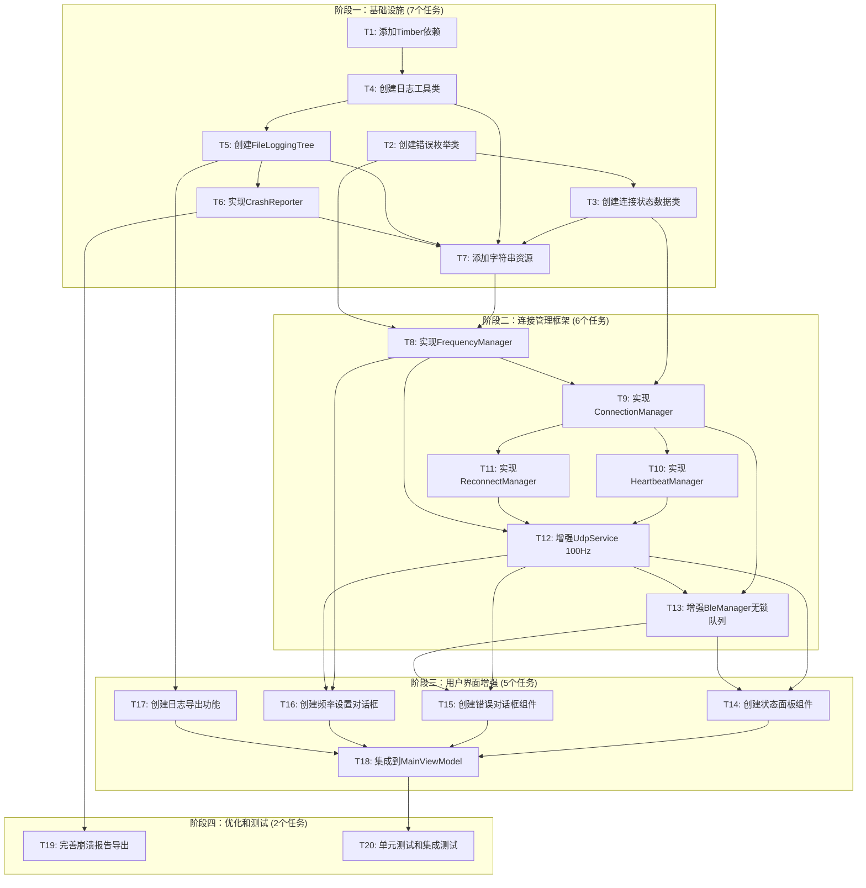

# TASK_UDP_BLE_Improvement.md

## 原子任务分解

### 任务总览

本任务分解将UDP和BLE改进项目分为4个阶段、20个原子任务，每个任务具有独立的输入输出契约和可验证的验收标准。

**用户反馈更新（2024-01-28）**：
- 数据频率：50Hz → 100Hz基础频率，支持10-200Hz可配置
- 移除性能限制
- 非阻塞设计：所有IO操作在Dispatchers.IO
- 新增：全局崩溃捕获和报告功能

### 任务依赖关系图



## 阶段一：基础设施

### T1: 添加Timber依赖

**输入契约**：
- build.gradle文件路径
- 当前依赖配置

**输出契约**：
- build.gradle中新增Timber依赖
- 项目能够导入Timber类

**实现约束**：
- 使用版本5.0.1
- 仅添加到debugImplementation或implementation

**依赖关系**：
- 前置：无
- 后置：T4, T5

**验收标准**：
- [ ] build.gradle同步成功
- [ ] Gradle构建成功
- [ ] 能够导入com.jakewharton.timber.timber

**验收检查**：
```bash
./gradlew dependencies | grep timber
./gradlew assembleDebug
```

---

### T2: 创建错误枚举类

**输入契约**：
- CONSENSUS文档中的错误分类设计
- 现有代码风格和规范

**输出契约**：
- 文件：domain/error/ConnectionError.kt
- 定义完整的ConnectionError密封类
- 定义ErrorSeverity枚举
- 定义ConnectionType枚举

**实现约束**：
- 每个错误包含code, messageResId, suggestionResId
- 与UI层字符串资源ID对应

**依赖关系**：
- 前置：无
- 后置：T3, T8

**验收标准**：
- [ ] 文件位于正确目录
- [ ] 包含至少8种常见错误类型
- [ ] 代码通过静态分析

---

### T3: 创建连接状态数据类

**输入契约**：
- DESIGN文档中的状态定义
- CONSENSUS文档中的状态流设计

**输出契约**：
- 文件：domain/connection/ConnectionState.kt
- ConnectionState枚举（DISCONNECTED, CONNECTING, CONNECTED, RECONNECTING, ERROR, HEARTBEAT_FAILED）
- ConnectionStatus数据类
- ConnectionStats数据类
- ConnectionType枚举

**实现约束**：
- 使用Kotlin数据类
- 提供默认值

**依赖关系**：
- 前置：T2
- 后置：T9, T10, T11

**验收标准**：
- [ ] 文件位于正确目录
- [ ] 所有枚举值有文档注释

---

### T4: 创建日志工具类

**输入契约**：
- DESIGN文档中的日志系统设计
- 非阻塞设计要求

**输出契约**：
- 文件：util/LogUtil.kt
- LogUtil单例对象
- LogLevel枚举（DEBUG, INFO, WARN, ERROR）
- 封装Timber调用
- **非阻塞设计**：使用Channel确保异步写入

**实现约束**：
- 与现有Log.xxx调用兼容
- 支持日志级别动态调整
- **必须非阻塞**：日志调用不等待文件写入

**依赖关系**：
- 前置：T1
- 后置：T5, T7, T17

**验收标准**：
- [ ] 文件位于正确目录
- [ ] LogUtil.d/i/w/e方法可用
- [ ] 日志级别可配置
- [ ] 单元测试验证非阻塞特性

---

### T5: 创建FileLoggingTree

**输入契约**：
- DESIGN文档中的FileTree设计
- 非阻塞设计要求

**输出契约**：
- 文件：util/log/FileLoggingTree.kt
- 继承Timber.Tree
- **完全异步**：使用协程Dispatchers.IO
- 支持日志文件轮转（最多5个文件，每个1MB）
- 时间戳格式：yyyy-MM-dd HH:mm:ss.SSS

**实现约束**：
- **必须非阻塞**：文件操作在IO线程
- 异常处理完善，不影响主流程

**依赖关系**：
- 前置：T1, T4
- 后置：T6, T7, T17

**验收标准**：
- [ ] 文件位于正确目录
- [ ] 日志文件创建正确
- [ ] 日志轮转正常工作
- [ ] 写入不影响应用性能（无阻塞）

---

### T6: 实现CrashReporter

**输入契约**：
- DESIGN文档中的崩溃捕获设计
- 非阻塞设计要求

**输出契约**：
- 文件：util/crash/CrashReporter.kt
- **全局异常处理器**：Thread.setDefaultUncaughtExceptionHandler
- **日志缓存**：崩溃前最后100条日志
- **报告生成**：包含堆栈跟踪、设备信息、应用状态
- **报告导出**：支持导出崩溃报告

**实现约束**：
- **必须非阻塞**：崩溃处理不阻塞原始异常处理器
- 初始化时捕获当前异常处理器
- 处理异常时使用try-catch保护

**依赖关系**：
- 前置：T4, T5
- 后置：T7, T19

**验收标准**：
- [ ] 文件位于正确目录
- [ ] 全局异常处理器正确安装
- [ ] 崩溃时收集完整堆栈跟踪
- [ ] 崩溃前最后100条日志自动保存
- [ ] 下次启动检测并提示用户

---

### T7: 添加字符串资源

**输入契约**：
- CONSENSUS文档中的错误消息列表
- strings.xml现有结构

**输出契约**：
- 更新strings.xml
- 添加所有错误消息和提示
- 添加状态面板标签
- 添加对话框按钮文本
- 添加频率设置相关字符串
- 添加崩溃报告相关字符串

**实现约束**：
- 使用字符串资源引用而非硬编码
- 命名规范：error_<type>_<detail>

**依赖关系**：
- 前置：T2, T3, T4, T5, T6
- 后置：T8, T12, T13

**验收标准**：
- [ ] strings.xml包含所有必要字符串
- [ ] 字符串ID命名规范
- [ ] 中英文对应

## 阶段二：连接管理框架

### T8: 实现FrequencyManager

**输入契约**：
- DESIGN文档中的频率管理设计
- 用户反馈：100Hz基础频率，10-200Hz可配置

**输出契约**：
- 文件：domain/connection/FrequencyManager.kt
- **基础频率**：100Hz
- **可配置范围**：10-200Hz
- **动态调整**：频率更改立即生效
- **DataStore持久化**：设置永久保存

**实现约束**：
- **非阻塞**：状态更新采用StateFlow
- 频率范围验证：10-200Hz
- 默认值：100Hz

**依赖关系**：
- 前置：T2, T7
- 后置：T9, T12, T16

**验收标准**：
- [ ] 文件位于正确目录
- [ ] 基础频率100Hz
- [ ] 支持10-200Hz调节
- [ ] 频率更改立即生效
- [ ] 设置持久化保存

---

### T9: 实现ConnectionManager

**输入契约**：
- DESIGN文档中的ConnectionManager接口
- MainViewModel现有状态管理模式

**输出契约**：
- 文件：domain/connection/ConnectionManager.kt
- ConnectionManager单例
- 实现ConnectionManager接口
- 状态流管理（udpState, bleState, lastError, dataRate）
- 连接操作方法

**实现约束**：
- 单例模式（与BleManager一致）
- 协程作用域管理
- 线程安全

**依赖关系**：
- 前置：T3, T8
- 后置：T10, T11, T13

**验收标准**：
- [ ] 文件位于正确目录
- [ ] 单例正确实现
- [ ] 状态流发射正确值
- [ ] 频率管理正常工作

---

### T10: 实现HeartbeatManager

**输入契约**：
- DESIGN文档中的HeartbeatManager接口
- ConnectionManager中的心跳调度需求

**输出契约**：
- 文件：domain/connection/HeartbeatManager.kt
- HeartbeatManager接口
- HeartbeatManagerImpl实现
- 支持UDP和BLE两种类型
- 可配置间隔和超时时间

**实现约束**：
- **非阻塞**：使用协程delay而非Timer
- 超时检测准确
- 支持启动/停止/重置

**依赖关系**：
- 前置：T9
- 后置：T12

**验收标准**：
- [ ] 文件位于正确目录
- [ ] 心跳间隔可配置
- [ ] 超时检测准确
- [ ] 启动/停止无内存泄漏

---

### T11: 实现ReconnectManager

**输入契约**：
- DESIGN文档中的ReconnectManager接口
- 指数退避重试策略需求

**输出契约**：
- 文件：domain/connection/ReconnectManager.kt
- ReconnectManager接口
- ReconnectManagerImpl实现
- 指数退避策略（1s, 2s, 4s, 8s...）
- 最大重试次数限制（默认3次）

**实现约束**：
- 协程作用域管理
- 重试任务可取消
- 重连成功重置计数

**依赖关系**：
- 前置：T9
- 后置：T12

**验收标准**：
- [ ] 文件位于正确目录
- [ ] 指数退避正确实现
- [ ] 重试可取消
- [ ] 最大次数可配置

---

### T12: 增强UdpService

**输入契约**：
- 现有的UdpService.kt
- DESIGN文档中的错误回调设计
- **100Hz动态频率要求**

**输出契约**：
- 更新UdpService.kt
- **基础频率100Hz**（而非之前的50Hz）
- 添加ConnectionErrorCallback注册
- 实现详细错误分类
- 心跳检测集成
- 发送统计更新
- **动态频率**：频率更改立即生效

**实现约束**：
- 向后兼容（现有功能不变）
- 错误回调非阻塞
- **频率动态调整**：不重启服务即可改变频率

**依赖关系**：
- 前置：T7, T10, T11, T8
- 后置：T13, T14, T15

**验收标准**：
- [ ] 现有功能测试通过
- [ ] 基础频率100Hz
- [ ] 频率10-200Hz可配置
- [ ] 错误分类正确
- [ ] 心跳检测正常工作
- [ ] 统计更新正确

---

### T13: 增强BleManager

**输入契约**：
- 现有的BleManager.kt
- DESIGN文档中的错误回调设计
- **100Hz无锁队列要求**

**输出契约**：
- 更新BleManager.kt
- 添加ConnectionErrorCallback注册
- 实现错误分类
- **实现无锁写入队列**：使用ConcurrentLinkedQueue
- 连接参数优化

**实现约束**：
- 向后兼容
- **无锁队列**：写入不阻塞
- 队列满时丢弃旧数据（滑动窗口）

**依赖关系**：
- 前置：T7, T9, T12
- 后置：T14, T15

**验收标准**：
- [ ] 现有功能测试通过
- [ ] 错误分类正确
- [ ] 写入队列正常工作
- [ ] 100Hz数据不丢失
- [ ] 连接参数优化生效

## 阶段三：用户界面增强

### T14: 创建状态面板组件

**输入契约**：
- DESIGN文档中的状态面板设计
- MainScreen现有布局结构

**输出契约**：
- 文件：ui/components/ConnectionStatusPanel.kt
- Composable函数
- 显示UDP和BLE状态
- 显示连接统计数据
- **显示当前频率**（可点击设置）
- 响应状态变化

**实现约束**：
- 使用Jetpack Compose
- 遵循项目UI风格
- **非阻塞**：状态更新不卡顿UI

**依赖关系**：
- 前置：T12, T13
- 后置：T18

**验收标准**：
- [ ] 文件位于正确目录
- [ ] 显示正确的状态和颜色
- [ ] 统计数据正确更新
- [ ] 频率显示和设置入口
- [ ] UI不卡顿

---

### T15: 创建错误对话框组件

**输入契约**：
- DESIGN文档中的错误对话框设计
- MainScreen现有对话框模式

**输出契约**：
- 文件：ui/components/ErrorDialog.kt
- AlertDialog包装
- 显示错误码、消息、建议
- 支持操作按钮
- 响应错误状态

**实现约束**：
- 使用Material 3 AlertDialog
- 中英文支持
- 清晰的视觉层次

**依赖关系**：
- 前置：T12, T13
- 后置：T18

**验收标准**：
- [ ] 文件位于正确目录
- [ ] 错误信息完整显示
- [ ] 按钮响应正确
- [ ] 样式符合设计

---

### T16: 创建频率设置对话框

**输入契约**：
- DESIGN文档中的频率设置设计
- FrequencyManager接口

**输出契约**：
- 文件：ui/components/DataRateSettingDialog.kt
- Slider组件：10-200Hz范围
- 10Hz步进
- 实时预览当前值
- 确认/取消按钮

**实现约束**：
- 使用Material 3 Slider
- 数值验证：10-200Hz
- 即时应用更改

**依赖关系**：
- 前置：T8, T12
- 后置：T18

**验收标准**：
- [ ] 文件位于正确目录
- [ ] 范围10-200Hz正确
- [ ] 步进10Hz正确
- [ ] 频率更改立即生效

---

### T17: 实现日志导出功能

**输入契约**：
- DESIGN文档中的日志导出设计
- FileLoggingTree文件位置

**输出契约**：
- 文件：ui/components/LogExportDialog.kt
- 日志文件选择对话框
- 导出为.txt文件
- 支持分享或保存

**实现约束**：
- 使用Android分享Intent
- 文件命名规范：app_logs_yyyyMMdd_HHmmss.txt
- **非阻塞**：导出操作在IO线程

**依赖关系**：
- 前置：T4, T5
- 后置：T18

**验收标准**：
- [ ] 文件位于正确目录
- [ ] 导出文件格式正确
- [ ] 分享功能正常工作
- [ ] 异常处理完善

---

### T18: 集成到MainViewModel

**输入契约**：
- 现有的MainViewModel.kt
- ConnectionManager状态流
- 所有UI组件

**输出契约**：
- 更新MainViewModel.kt
- 订阅ConnectionManager状态
- 集成状态面板
- 集成错误对话框
- 集成日志导出
- 集成频率设置
- 集成崩溃报告检测

**实现约束**：
- 不破坏现有功能
- 状态流正确收集
- 资源正确释放
- **非阻塞**：状态更新不影响UI流畅度

**依赖关系**：
- 前置：T14, T15, T16, T17
- 后置：T20

**验收标准**：
- [ ] 现有功能测试通过
- [ ] 状态面板正确显示
- [ ] 错误对话框正确弹出
- [ ] 频率设置正常工作
- [ ] 日志导出正常工作
- [ ] 崩溃报告检测正常

## 阶段四：优化和测试

### T19: 完善崩溃报告导出

**输入契约**：
- T6中的基础CrashReporter实现
- MainViewModel中的崩溃报告检测

**输出契约**：
- 更新CrashReporter.kt
- 崩溃报告对话框组件
- 报告分享功能
- 报告历史管理

**实现约束**：
- 简洁的用户界面
- 支持多种分享方式
- 报告清理功能

**依赖关系**：
- 前置：T6
- 后置：无

**验收标准**：
- [ ] 崩溃报告对话框显示正确
- [ ] 报告可导出和分享
- [ ] 历史报告可查看和清理

---

### T20: 单元测试和集成测试

**输入契约**：
- 所有实现代码
- 现有测试结构（如存在）

**输出契约**：
- 文件：app/src/test/java/.../ConnectionManagerTest.kt
- 文件：app/src/test/java/.../FrequencyManagerTest.kt
- 文件：app/src/test/java/.../HeartbeatManagerTest.kt
- 文件：app/src/test/java/.../ReconnectManagerTest.kt
- 文件：app/src/test/java/.../NonBlockingQueueTest.kt
- 文件：app/src/test/java/.../CrashReporterTest.kt

**实现约束**：
- 使用JUnit 5
- 使用MockK或Mockito
- **重点测试非阻塞特性**
- 覆盖率 > 80%

**依赖关系**：
- 前置：T18
- 后置：无

**验收标准**：
- [ ] 单元测试覆盖率 > 80%
- [ ] 所有测试通过
- [ ] 测试独立运行
- [ ] 集成测试验证完整流程
- [ ] **非阻塞验证测试通过**

**验收检查**：
```bash
./gradlew test
./gradlew jacocoTestReport
./gradlew lint
```

## 任务时间估算

| 阶段 | 任务数 | 预估时间 |
|-----|-------|---------|
| 阶段一：基础设施 | 7 | 1-2天 |
| 阶段二：连接管理框架 | 6 | 2-3天 |
| 阶段三：用户界面增强 | 5 | 2-3天 |
| 阶段四：优化和测试 | 2 | 2天 |
| **合计** | **20** | **7-10天** |

## 关键变更点（基于用户反馈）

### 数据频率变更

| 项目 | 旧值 | 新值 |
|-----|------|------|
| 基础频率 | 50Hz | **100Hz** |
| 默认频率 | 50Hz | **100Hz** |
| 频率范围 | 固定 | **10-200Hz可配置** |
| 频率存储 | 无 | **DataStore持久化** |

### 非阻塞设计要求

| 组件 | 设计要求 | 验证方法 |
|-----|---------|---------|
| 日志系统 | Channel + Dispatchers.IO | StrictMode |
| 队列操作 | ConcurrentLinkedQueue | 压力测试 |
| UI更新 | StateFlow | UI响应测试 |
| 文件IO | 异步写入 | 主线程无卡顿 |

### 崩溃捕获新增功能

| 功能 | 说明 | 优先级 |
|-----|------|-------|
| 全局异常处理器 | Thread.setDefaultUncaughtExceptionHandler | 必须 |
| 日志缓存 | 最后100条日志 | 必须 |
| 报告生成 | 堆栈跟踪+设备信息 | 必须 |
| 报告导出 | 用户可导出分享 | 必须 |

## 风险和缓解措施

| 任务 | 风险 | 缓解措施 |
|-----|------|---------|
| T12 | 100Hz频率下UDP性能 | 协程优化，异步发送 |
| T13 | 100Hz频率下BLE队列溢出 | 滑动窗口丢弃旧数据 |
| T4, T5 | 日志系统阻塞主线程 | Channel异步，Dispatchers.IO |
| T6 | 崩溃捕获本身崩溃 | init中try-catch保护 |
| T20 | 非阻塞验证失败 | StrictMode + 压力测试 |

## 执行顺序

按照依赖关系，建议执行顺序：
1. T1 → T2 → T3 → T4 → T5 → T6 → T7
2. T8 → T9 → T10 → T11
3. T12 → T13
4. T14 → T15 → T16 → T17 → T18
5. T19 → T20

## 非阻塞验证检查清单

在每个涉及IO操作的任务中，必须验证以下检查项：

- [ ] 主线程无Disk IO操作（使用StrictMode检测）
- [ ] 队列写入无锁等待（使用ConcurrentLinkedQueue）
- [ ] UI状态更新采用StateFlow/Channel
- [ ] 文件写入使用Dispatchers.IO
- [ ] 压力测试下无阻塞现象

## 代码质量要求

所有代码必须满足：

1. **非阻塞**：所有IO操作在Dispatchers.IO
2. **协程安全**：避免协程泄漏
3. **异常安全**：所有可能崩溃的操作包裹在try-catch中
4. **测试覆盖**：核心逻辑单元测试覆盖率 > 80%
5. **无TODO注释**：所有TODO必须在任务中实现
